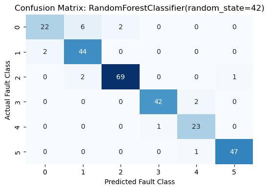
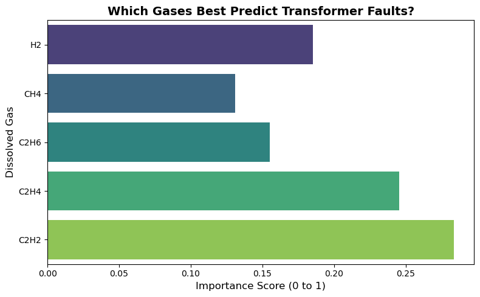
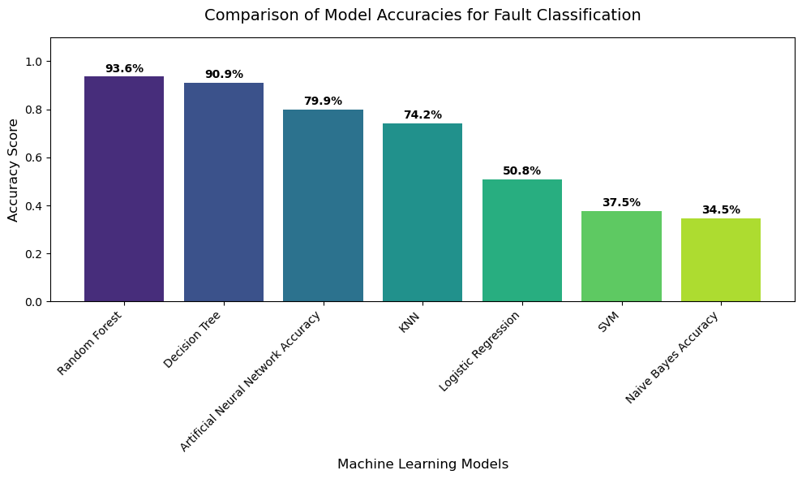

# Intelligent Transformer Fault Prediction using Pseudo-Labeling

## 📌 Project Overview
This project applies Machine Learning to predict industrial transformer faults based on Dissolved Gas Analysis (DGA) data. Instead of relying solely on a static dataset, this pipeline implements **Pseudo-Labeling (Semi-Supervised Learning)**. The system predicts fault classes for new, unlabelled data and automatically feeds those predictions back into a continuously growing "Master Dataset" to iteratively improve future training.

## ⚙️ The Engineering Context
In power systems, monitoring dissolved gases (Hydrogen, Methane, Ethane, Ethylene, and Acetylene) in transformer oil is critical for early fault detection. This project takes raw DGA sensor data, cleans it, and classifies the current health state of the transformer, allowing for predictive maintenance before catastrophic failure occurs.

## 🚀 Key Features & Pipeline

### 1. Robust Data Integrity & Preprocessing
* **Automated Auditing:** Features a custom `data_integrity_check` function that meticulously tracks missing values (`NaN`), infinite values (`Inf`), and zeros before and after cleaning.
* **Dataset Aggregation:** Automatically ingests and combines multiple raw CSV datasets into a single, clean master file.
* **Stratified Splitting:** Handles imbalanced fault classes by using stratified train-test splits (`stratify=y`) to ensure the model trains accurately on rare fault types.

### 2. Multi-Model Machine Learning Classification
Trained and evaluated multiple algorithms to find the most accurate predictor:
* **Random Forest Classifier:** Used for robust, tree-based classification without the need for feature scaling. (Achieved 93.5% accuracy).
* **Decision Tree Classifier:** For interpretable, rule-based fault detection. (Achieved 90.9% accuracy).
* **Support Vector Machine (SVM):** Implemented an RBF kernel SVM. Applied `StandardScaler` to normalize the distance-based gas concentration features prior to training.

### 3. Semi-Supervised "Pseudo-Labeling" Engine
This is the core differentiator of this project. To handle scenarios with limited labeled data, the pipeline uses **Pseudo-Labeling**:
* The best-performing model evaluates entirely new, unlabelled DGA readings.
* It assigns a predicted "Fault Class" to these new samples.
* The system automatically appends these newly predicted samples to the `combined_dataset_cleaned.csv` Master File.
* **Result:** The dataset continuously grows, simulating an automated feedback loop found in production-level industrial IoT systems.

## 📊 Evaluation & Visual Proof

* The models are evaluated using accuracy scores, precision, recall, and F1-scores to account for imbalanced industrial data. 
* Seaborn heatmaps are generated for confusion matrices to visually verify that the models are minimizing False Positives (predicting a fault when there isn't one) and False Negatives (missing a critical fault).

## 🛠️ Built With
* **Python 3**
* **Pandas & NumPy:** Data wrangling and integrity tracking.
* **Scikit-Learn:** Model building (RF, DT, SVM), scaling, and evaluation metrics.
* **Matplotlib & Seaborn:** Data visualization.
